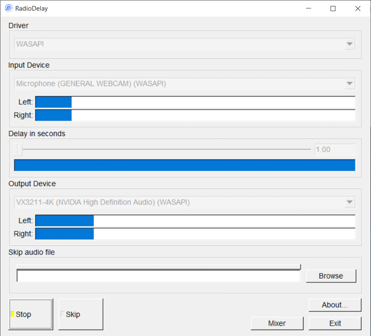

# Radiodelay
## Audio input/output delay for Windows, MacOS, Linux



#### (C)2006-2020 DaanSystems		
#### License: GPLv3
#### Homepage: https://daansystems.com/radiodelay
#### Github: https://github.com/daansystems/radiodelay

# Introduction
Radiodelay is a tool to delay audio from your
FM Radio in your TV tuner card or from an external input source.
It is particulary usefull for listening to sports commentary
on the radio when watching TV. Radio commentary is often a few
seconds earlier than TV.

# Commandline Options
-delay x.x : Set the delay in x.x seconds.  
-in x : Preselect the input device by device index number.  
-out x : Preselect the output device by device index number.  
-play : Start playing automatically.  
-skipfile : Set skipfile.

## Example:
```
RadioDelay.exe -delay 5.6 -in 0 -out 1 -play
```

# Dependencies
Radiodelay is based in part on the work of the 
FLTK project (http://www.fltk.org).

Radiodelay uses miniaudio for input/output (https://github.com/mackron/miniaudio).

# Compiling

A simple Makefile is available for Windows/Linux/MacOS. On windows you can use MinGW/MSYS to compile. Visual Studio should be easy too.
On linux/Mac use g++ or clang++.

##### Example Windows 64 bit MSYS:
```
$ pacman -S mingw-w64-x86_64-fltk  
$ make
```
##### Example Arch Linux:
```
$ pacman -S fltk  
$ make
```
##### Example MacOS:
```
$ brew install fltk  
$ make
```
# Revision history
build 20201127

+ fix -driver commandline argument.

build 20201126

+ allow change of driver.
+ update miniaudio.
+ cleanup makefile a bit.

build 20201004

+ Released source on github.
+ New License GPLv3.

build 20200226

+ Now working on Windows/Linux/Mac.
+ Uses FLTK GUI now.
+ Uses miniaudio now.
+ New resizable look.

build 20200125

+ Uses WASAPI for higher accuracy.
+ 64bit version.
+ Add skip audio file.
+ Window resizable.
+ Delay max 30 minutes.
+ Fixed selecting input/output devices from commandline.

build 20161107

+ Deprecated < Windows 7.
+ Input levels are shown immediately.
+ Fix UI when using commandline option -play.

build 20100720

+ Delay is now max 30 seconds.
+ Added commandline options.
+ Shows volume mixer for Vista/Win7.

build 20071220

+ Delay is now 20 seconds.

build 20061117

+ Fixed capture device keeping silent.

build 20061029

+ First release